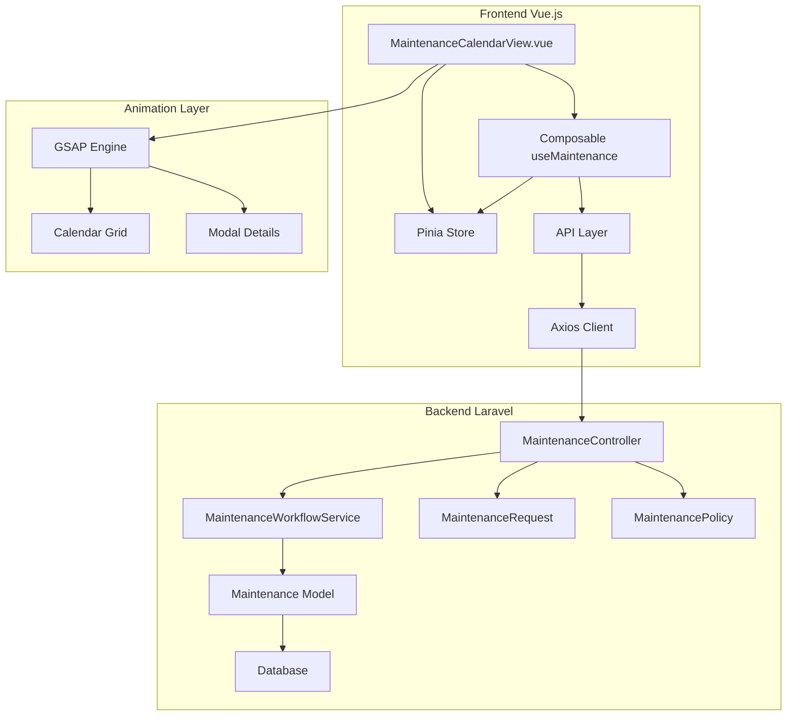
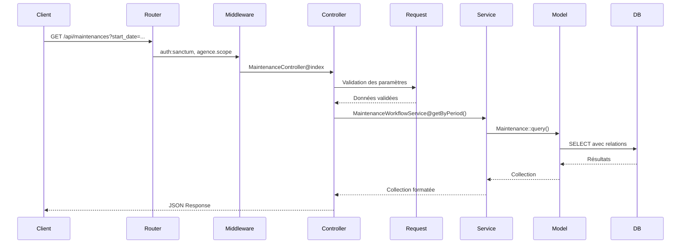
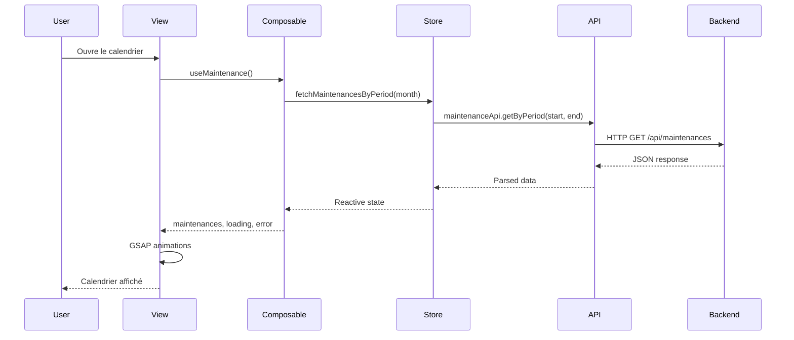

# Design Document - Calendrier de Maintenance Moderne (Bento Style)

## Overview

Ce document décrit la conception technique du **Calendrier de Maintenance Moderne** avec un design Bento et des effets Glassmorphism. Le système permet de visualiser, gérer et interagir avec les interventions de maintenance (préventives et correctives) dans une interface calendrier responsive et animée.

### Objectifs

1. Fournir une API RESTful Laravel pour la gestion des maintenances calendaires
2. Implémenter une interface Vue.js 3 moderne avec design Bento et Glassmorphism
3. Intégrer des animations fluides avec GSAP
4. Assurer une expérience responsive (mobile, tablette, desktop)
5. Respecter l'architecture existante (Laravel 13, Vue.js 3, Pinia, Tailwind/PrimeVue)

### Contexte Technique

- **Backend**: Laravel 13.8 avec Sanctum pour l'authentification
- **Frontend**: Vue.js 3 (Composition API) avec Pinia pour la gestion d'état
- **Styling**: Tailwind CSS combiné avec PrimeVue
- **Animations**: GSAP (GreenSock Animation Platform)
- **API**: RESTful avec format JSON
- **Base de données**: Existante avec table `maintenances`

## Architecture

### Vue d'Ensemble du Système

Le système suit une architecture client-serveur classique avec séparation claire des responsabilités:



### Architecture Backend (Laravel)

#### Couches et Responsabilités

1. **Routes** (`routes/api.php`): Définit les endpoints REST
2. **Middleware**: Authentification (Sanctum) et scope d'agence
3. **Controllers**: Gestion des requêtes HTTP et orchestration
4. **Form Requests**: Validation des données entrantes
5. **Services**: Logique métier et orchestration complexe
6. **Models**: ORM Eloquent et relations base de données
7. **Policies**: Autorisation et contrôle d'accès
8. **Factories**: Génération de données de test

#### Flux de Requête Backend



### Architecture Frontend (Vue.js 3)

#### Structure des Composants

```
src/
├── views/
│   └── MaintenanceCalendarView.vue      # Vue principale du calendrier
├── components/
│   ├── maintenance/
│   │   ├── CalendarGrid.vue             # Grille calendaire
│   │   ├── CalendarDay.vue              # Cellule jour
│   │   ├── MaintenanceEventCard.vue     # Carte événement
│   │   └── MaintenanceDetailsModal.vue  # Modale détails
├── stores/
│   └── maintenanceStore.js              # Pinia store
├── composables/
│   └── useMaintenance.js                # Composable réutilisable
├── api/
│   └── maintenanceApi.js                # Couche API
└── utils/
    ├── dateFormatter.js                  # Formatage dates
    └── gsapAnimations.js                 # Animations GSAP
```

#### Flux de Données Frontend



## Components and Interfaces

### Backend Components

#### 1. MaintenanceRequest (Form Request)

**Fichier**: `backend/app/Http/Requests/MaintenanceRequest.php`

**Responsabilité**: Validation des données de création de maintenance préventive

**Structure**:
```php
class MaintenanceRequest extends FormRequest
{
    public function authorize(): bool
    public function rules(): array
    public function messages(): array
}
```

**Règles de validation**:
- `equipement_id`: required, exists:equipements,id
- `date_prevue`: required, date, after_or_equal:today
- `responsable`: required, string, max:255
- `type_maintenance`: required, in:préventif,correctif
- `cout`: nullable, numeric, min:0
- `observations`: nullable, string, max:1000

#### 2. MaintenanceWorkflowService

**Fichier**: `backend/app/Services/MaintenanceWorkflowService.php`

**Responsabilité**: Gestion de la logique métier des maintenances

**Méthodes publiques**:

```php
class MaintenanceWorkflowService
{
    /**
     * Planifier une maintenance préventive
     * @param array $data
     * @return Maintenance
     */
    public function planifierPreventive(array $data): Maintenance;
    
    /**
     * Récupérer les maintenances par période
     * @param string $startDate
     * @param string $endDate
     * @param array $filters
     * @return Collection
     */
    public function getByPeriod(string $startDate, string $endDate, array $filters = []): Collection;
    
    /**
     * Récupérer une maintenance avec relations
     * @param int $id
     * @return Maintenance
     */
    public function getMaintenanceWithRelations(int $id): Maintenance;
}
```

#### 3. MaintenanceController

**Fichier**: `backend/app/Http/Controllers/MaintenanceController.php`

**Responsabilité**: Gestion des requêtes HTTP pour les maintenances

**Endpoints**:

| Méthode | Endpoint | Description | Middleware |
|---------|----------|-------------|------------|
| GET | `/api/maintenances` | Liste des maintenances par période | auth:sanctum, agence.scope |
| GET | `/api/maintenances/{id}` | Détails d'une maintenance | auth:sanctum, agence.scope |
| POST | `/api/maintenances` | Créer une maintenance | auth:sanctum, agence.scope |
| PUT | `/api/maintenances/{id}` | Mettre à jour une maintenance | auth:sanctum, agence.scope |

**Structure des méthodes**:

```php
class MaintenanceController extends Controller
{
    public function __construct(
        private MaintenanceWorkflowService $workflowService
    ) {}
    
    /**
     * Liste des maintenances avec filtres
     * Query params: start_date, end_date, month, type_maintenance, statut
     */
    public function index(Request $request): JsonResponse;
    
    /**
     * Détails d'une maintenance
     */
    public function show(int $id): JsonResponse;
    
    /**
     * Créer une maintenance préventive
     */
    public function store(MaintenanceRequest $request): JsonResponse;
}
```

#### 4. MaintenanceFactory

**Fichier**: `backend/database/factories/MaintenanceFactory.php`

**Responsabilité**: Génération de données de test

**Structure**:
```php
class MaintenanceFactory extends Factory
{
    protected $model = Maintenance::class;
    
    public function definition(): array
    {
        return [
            'equipement_id' => Equipement::factory(),
            'type_maintenance' => 'préventif',
            'date_prevue' => $this->faker->dateTimeBetween('now', '+3 months'),
            'responsable' => $this->faker->name(),
            'statut' => $this->faker->randomElement(['Planifié', 'En cours', 'Terminé']),
            'cout' => $this->faker->randomFloat(2, 50, 5000),
            // ...
        ];
    }
}
```

#### 5. Routes API

**Fichier**: `backend/routes/api.php`

```php
Route::middleware(['auth:sanctum', 'agence.scope'])->group(function () {
    Route::prefix('maintenances')->group(function () {
        Route::get('/', [MaintenanceController::class, 'index']);
        Route::get('/{id}', [MaintenanceController::class, 'show']);
        Route::post('/', [MaintenanceController::class, 'store']);
        Route::put('/{id}', [MaintenanceController::class, 'update']);
    });
});
```

### Frontend Components

#### 1. MaintenanceCalendarView.vue

**Fichier**: `frontend/src/views/MaintenanceCalendarView.vue`

**Responsabilité**: Vue principale orchestrant le calendrier

**Props**: Aucune (vue racine)

**Composables utilisés**:
- `useMaintenance()`: Accès au store et actions
- `useGsapAnimations()`: Animations GSAP

**État local**:
```typescript
interface CalendarState {
  currentMonth: Date;
  selectedMaintenance: Maintenance | null;
  isModalOpen: boolean;
  filters: {
    typeMainten type: string[];
    statuts: string[];
  };
}
```

**Méthodes principales**:
- `loadMonthData()`: Charge les maintenances du mois
- `navigateMonth(direction: 'prev' | 'next')`: Navigation mois
- `openDetails(maintenance: Maintenance)`: Ouvre la modale
- `applyFilters()`: Applique les filtres de type/statut

**Template structure**:
```vue
<template>
  <div class="maintenance-calendar-view">
    <CalendarHeader />
    <CalendarFilters />
    <CalendarGrid :maintenances="filteredMaintenances" />
    <MaintenanceDetailsModal />
  </div>
</template>
```

#### 2. CalendarGrid.vue

**Fichier**: `frontend/src/components/maintenance/CalendarGrid.vue`

**Responsabilité**: Génération et affichage de la grille calendaire

**Props**:
```typescript
interface Props {
  maintenances: Maintenance[];
  currentMonth: Date;
}
```

**Computed**:
- `monthGrid`: Génère un tableau 2D [semaine][jour] pour le mois
- `daysOfWeek`: ['Lun', 'Mar', 'Mer', 'Jeu', 'Ven', 'Sam', 'Dim']

**Structure de grille**:
```typescript
interface DayCell {
  date: Date;
  isCurrentMonth: boolean;
  isToday: boolean;
  maintenances: Maintenance[];
}

type MonthGrid = DayCell[][];
```

#### 3. CalendarDay.vue

**Fichier**: `frontend/src/components/maintenance/CalendarDay.vue`

**Responsabilité**: Affichage d'une cellule jour avec ses événements

**Props**:
```typescript
interface Props {
  day: DayCell;
}
```

**Computed**:
- `visibleMaintenances`: Limite à 3 événements visibles
- `hasMore`: Booléen indiquant s'il y a plus de 3 événements

**Classes CSS dynamiques**:
```typescript
const cellClasses = computed(() => ({
  'bg-gray-50': !props.day.isCurrentMonth,
  'bg-white': props.day.isCurrentMonth,
  'ring-2 ring-blue-500': props.day.isToday,
}));
```

#### 4. MaintenanceEventCard.vue

**Fichier**: `frontend/src/components/maintenance/MaintenanceEventCard.vue`

**Responsabilité**: Affichage d'une carte événement de maintenance

**Props**:
```typescript
interface Props {
  maintenance: Maintenance;
  compact?: boolean;
}
```

**Computed**:
- `statusColor`: Retourne les classes Tailwind selon le statut
- `typeIcon`: Icône selon le type (préventif/correctif)

**Classes Glassmorphism**:
```css
.event-card {
  @apply backdrop-blur-lg bg-white/30 border border-white/20;
  @apply shadow-lg rounded-lg;
}
```

**Mapping couleurs par statut**:
- **Planifié**: `bg-blue-500/20 border-blue-500 text-blue-700`
- **En cours**: `bg-orange-500/20 border-orange-500 text-orange-700`
- **Terminé**: `bg-green-500/20 border-green-500 text-green-700`

#### 5. MaintenanceDetailsModal.vue

**Fichier**: `frontend/src/components/maintenance/MaintenanceDetailsModal.vue`

**Responsabilité**: Modale affichant les détails complets d'une maintenance

**Props**:
```typescript
interface Props {
  maintenance: Maintenance | null;
  isOpen: boolean;
}
```

**Emits**:
```typescript
interface Emits {
  (e: 'close'): void;
}
```

**Sections de la modale**:
1. **En-tête**: Type, statut, référence équipement
2. **Dates**: Date prévue, début, fin, durée calculée
3. **Responsables**: Responsable, technicien assigné
4. **Technique**: Diagnostic, observations
5. **Coût**: Montant formaté
6. **Relations**: Équipement, panne associée

**Animation GSAP** (ouverture/fermeture):
```typescript
const openModal = () => {
  gsap.from(modalRef.value, {
    scale: 0.8,
    opacity: 0,
    duration: 0.3,
    ease: 'power2.out'
  });
};
```

#### 6. Pinia Store - maintenanceStore.js

**Fichier**: `frontend/src/stores/maintenanceStore.js`

**Responsabilité**: Gestion d'état global des maintenances

**State**:
```typescript
interface MaintenanceState {
  maintenances: Maintenance[];
  loading: boolean;
  error: string | null;
  cache: Map<string, { data: Maintenance[], timestamp: number }>;
  selectedMaintenance: Maintenance | null;
}
```

**Getters**:
```typescript
const getters = {
  maintenancesByDate: (state) => (date: Date) => Maintenance[];
  maintenancesByStatus: (state) => (status: string) => Maintenance[];
  maintenancesByType: (state) => (type: string) => Maintenance[];
  isLoading: (state) => boolean;
  hasError: (state) => boolean;
}
```

**Actions**:
```typescript
const actions = {
  async fetchMaintenancesByPeriod(startDate: string, endDate: string, filters?: object): Promise<void>;
  async fetchMaintenanceById(id: number): Promise<void>;
  async createMaintenance(data: object): Promise<Maintenance>;
  clearCache(): void;
  resetError(): void;
}
```

**Logique de cache**:
- Clé de cache: `${startDate}_${endDate}`
- TTL: 5 minutes
- Invalidation automatique après création/modification

#### 7. Composable - useMaintenance.js

**Fichier**: `frontend/src/composables/useMaintenance.js`

**Responsabilité**: Encapsulation de la logique métier pour les composants

**Interface**:
```typescript
interface UseMaintenanceReturn {
  // State
  maintenances: ComputedRef<Maintenance[]>;
  loading: ComputedRef<boolean>;
  error: ComputedRef<string | null>;
  
  // Actions
  loadMaintenances: (month: Date) => Promise<void>;
  loadMaintenanceDetails: (id: number) => Promise<void>;
  createMaintenance: (data: object) => Promise<Maintenance>;
  
  // Utilities
  getMaintenancesForDay: (date: Date) => Maintenance[];
  filterByType: (type: string) => Maintenance[];
  filterByStatus: (status: string) => Maintenance[];
}
```

**Implémentation**:
```typescript
export function useMaintenance() {
  const store = useMaintenanceStore();
  const router = useRouter();
  
  const loadMaintenances = async (month: Date) => {
    const { start, end } = getMonthBounds(month);
    await store.fetchMaintenancesByPeriod(start, end);
  };
  
  // Gestion d'erreur avec notification
  const handleError = (error: Error) => {
    console.error('Maintenance error:', error);
    store.error = error.message;
    // Notification toast avec PrimeVue
  };
  
  return {
    maintenances: computed(() => store.maintenances),
    loading: computed(() => store.loading),
    error: computed(() => store.error),
    loadMaintenances,
    // ...
  };
}
```

#### 8. API Layer - maintenanceApi.js

**Fichier**: `frontend/src/api/maintenanceApi.js`

**Responsabilité**: Communication avec l'API backend

**Configuration Axios**:
```typescript
import axiosInstance from './axiosConfig';

const ENDPOINTS = {
  BASE: '/maintenances',
  BY_ID: (id: number) => `/maintenances/${id}`,
};
```

**Méthodes**:
```typescript
export const maintenanceApi = {
  /**
   * Récupère les maintenances par période
   */
  async getByPeriod(startDate: string, endDate: string, filters = {}) {
    const params = { start_date: startDate, end_date: endDate, ...filters };
    const response = await axiosInstance.get(ENDPOINTS.BASE, { params });
    return response.data;
  },
  
  /**
   * Récupère une maintenance par ID
   */
  async getById(id: number) {
    const response = await axiosInstance.get(ENDPOINTS.BY_ID(id));
    return response.data;
  },
  
  /**
   * Crée une nouvelle maintenance
   */
  async create(data: object) {
    const response = await axiosInstance.post(ENDPOINTS.BASE, data);
    return response.data;
  },
  
  /**
   * Récupère les maintenances d'un mois
   */
  async getByMonth(month: string) {
    const params = { month };
    const response = await axiosInstance.get(ENDPOINTS.BASE, { params });
    return response.data;
  },
};
```

#### 9. Utilitaires - dateFormatter.js

**Fichier**: `frontend/src/utils/dateFormatter.js`

**Responsabilité**: Formatage et parsing des dates

**Fonctions**:
```typescript
/**
 * Formate une date en format français
 * @param date - Date ISO ou objet Date
 * @returns string - Format: "14/03/2024"
 */
export function formatDateFr(date: string | Date): string;

/**
 * Formate une date avec le nom du mois
 * @returns string - Format: "14 mars 2024"
 */
export function formatDateLong(date: string | Date): string;

/**
 * Formate une heure
 * @returns string - Format: "14:30"
 */
export function formatTime(date: string | Date): string;

/**
 * Parse une date ISO en objet Date
 */
export function parseISODate(isoString: string): Date;

/**
 * Calcule la durée entre deux dates
 * @returns string - Format: "2 jours 3 heures"
 */
export function calculateDuration(start: Date, end: Date): string;

/**
 * Obtient les bornes d'un mois
 */
export function getMonthBounds(date: Date): { start: string; end: string };
```

#### 10. Utilitaires - gsapAnimations.js

**Fichier**: `frontend/src/utils/gsapAnimations.js`

**Responsabilité**: Animations GSAP réutilisables

**Fonctions**:
```typescript
import gsap from 'gsap';

/**
 * Anime l'apparition de la grille calendaire
 */
export function animateCalendarEntry(gridElement: HTMLElement): void {
  const cells = gridElement.querySelectorAll('.calendar-day');
  
  gsap.from(cells, {
    opacity: 0,
    y: 20,
    duration: 0.5,
    stagger: 0.02,
    ease: 'power2.out'
  });
}

/**
 * Anime l'ouverture d'une modale
 */
export function animateModalOpen(modalElement: HTMLElement): void {
  gsap.from(modalElement, {
    scale: 0.8,
    opacity: 0,
    duration: 0.3,
    ease: 'back.out(1.7)'
  });
}

/**
 * Anime la fermeture d'une modale
 */
export function animateModalClose(modalElement: HTMLElement): Promise<void> {
  return gsap.to(modalElement, {
    scale: 0.8,
    opacity: 0,
    duration: 0.2,
    ease: 'power2.in'
  }).then();
}

/**
 * Anime les cartes d'événements
 */
export function animateEventCards(cardsArray: HTMLElement[]): void {
  gsap.from(cardsArray, {
    scale: 0.9,
    opacity: 0,
    duration: 0.3,
    stagger: 0.05,
    ease: 'power2.out'
  });
}

/**
 * Nettoie toutes les animations GSAP actives
 */
export function cleanupAnimations(): void {
  gsap.killTweensOf('*');
}
```

## Data Models

### Backend - Maintenance Model

**Structure de la table `maintenances`**:

```typescript
interface MaintenanceSchema {
  id: number;
  panne_id: number | null;
  equipement_id: number;
  technicien_id: number | null;
  type_maintenance: 'préventif' | 'correctif';
  date_prevue: DateTime;
  responsable: string;
  technicien: string | null;
  diagnostic: string | null;
  cout: Decimal(10,2) | null;
  date_debut: DateTime | null;
  date_fin: DateTime | null;
  observations: string | null;
  statut: 'Planifié' | 'En cours' | 'Terminé';
  created_at: DateTime;
  updated_at: DateTime;
}
```

**Relations Eloquent**:

```php
class Maintenance extends Model
{
    // Relation: Maintenance appartient à un Équipement
    public function equipement(): BelongsTo;
    
    // Relation: Maintenance peut appartenir à une Panne
    public function panne(): BelongsTo;
    
    // Relation: Maintenance peut avoir un Technicien (User)
    public function technicienUser(): BelongsTo;
}
```

### Frontend - Maintenance Interface

**Interface TypeScript**:

```typescript
interface Maintenance {
  id: number;
  panne_id: number | null;
  equipement_id: number;
  technicien_id: number | null;
  type_maintenance: 'préventif' | 'correctif';
  date_prevue: string; // ISO 8601
  responsable: string;
  technicien: string | null;
  diagnostic: string | null;
  cout: number | null;
  date_debut: string | null;
  date_fin: string | null;
  observations: string | null;
  statut: 'Planifié' | 'En cours' | 'Terminé';
  created_at: string;
  updated_at: string;
  
  // Relations chargées (eager loading)
  equipement?: Equipement;
  panne?: Panne;
  technicienUser?: User;
}

interface Equipement {
  id: number;
  reference: string;
  marque: string;
  modele: string;
  categorie?: Categorie;
}

interface Panne {
  id: number;
  description: string;
  date_declaration: string;
}

interface User {
  id: number;
  name: string;
  email: string;
}
```

### API Response Formats

#### Liste des maintenances

**Endpoint**: `GET /api/maintenances?start_date=2024-03-01&end_date=2024-03-31`

**Response 200 OK**:
```json
{
  "success": true,
  "data": [
    {
      "id": 1,
      "equipement_id": 5,
      "type_maintenance": "préventif",
      "date_prevue": "2024-03-15T10:00:00Z",
      "responsable": "Jean Dupont",
      "statut": "Planifié",
      "cout": 250.50,
      "equipement": {
        "id": 5,
        "reference": "EQ-2024-001",
        "marque": "HP",
        "modele": "ProBook 450"
      },
      "panne": null,
      "technicienUser": null
    }
  ],
  "meta": {
    "total": 1,
    "per_page": 100,
    "current_page": 1
  }
}
```

#### Détails d'une maintenance

**Endpoint**: `GET /api/maintenances/1`

**Response 200 OK**:
```json
{
  "success": true,
  "data": {
    "id": 1,
    "equipement_id": 5,
    "type_maintenance": "préventif",
    "date_prevue": "2024-03-15T10:00:00Z",
    "date_debut": "2024-03-15T09:30:00Z",
    "date_fin": "2024-03-15T11:45:00Z",
    "responsable": "Jean Dupont",
    "technicien": "Marie Martin",
    "diagnostic": "Nettoyage et mise à jour système",
    "observations": "RAS, équipement en bon état",
    "cout": 250.50,
    "statut": "Terminé",
    "equipement": {
      "id": 5,
      "reference": "EQ-2024-001",
      "marque": "HP",
      "modele": "ProBook 450",
      "categorie": {
        "id": 2,
        "nom": "Ordinateurs portables"
      }
    },
    "panne": null,
    "technicienUser": {
      "id": 12,
      "name": "Marie Martin",
      "email": "marie.martin@example.com"
    }
  }
}
```

#### Création de maintenance

**Endpoint**: `POST /api/maintenances`

**Request Body**:
```json
{
  "equipement_id": 5,
  "type_maintenance": "préventif",
  "date_prevue": "2024-04-20",
  "responsable": "Jean Dupont",
  "cout": 300,
  "observations": "Maintenance trimestrielle planifiée"
}
```

**Response 201 Created**:
```json
{
  "success": true,
  "message": "Maintenance créée avec succès",
  "data": {
    "id": 2,
    "equipement_id": 5,
    "type_maintenance": "préventif",
    "date_prevue": "2024-04-20T00:00:00Z",
    "responsable": "Jean Dupont",
    "statut": "Planifié",
    "cout": 300,
    "observations": "Maintenance trimestrielle planifiée",
    "created_at": "2024-03-14T12:00:00Z"
  }
}
```

#### Erreurs de validation

**Response 422 Unprocessable Entity**:
```json
{
  "success": false,
  "message": "Erreur de validation",
  "errors": {
    "equipement_id": ["Le champ équipement est requis."],
    "date_prevue": ["La date prévue doit être une date valide après aujourd'hui."]
  }
}
```

#### Erreur non autorisé

**Response 403 Forbidden**:
```json
{
  "success": false,
  "message": "Vous n'avez pas les permissions pour accéder à cette maintenance."
}
```

### Grille Calendaire - Structure de Données

**Interface pour la grille mensuelle**:

```typescript
interface DayCell {
  date: Date;
  dateString: string; // Format: "2024-03-15"
  dayNumber: number; // 1-31
  isCurrentMonth: boolean;
  isToday: boolean;
  isPast: boolean;
  maintenances: Maintenance[];
  hasMultipleEvents: boolean;
}

interface WeekRow {
  days: DayCell[];
}

interface MonthGrid {
  year: number;
  month: number; // 0-11 (JavaScript)
  monthName: string;
  weeks: WeekRow[];
}
```

**Logique de génération de grille**:

```typescript
function generateMonthGrid(year: number, month: number, maintenances: Maintenance[]): MonthGrid {
  const firstDay = new Date(year, month, 1);
  const lastDay = new Date(year, month + 1, 0);
  
  // Ajuster pour commencer le lundi
  const startDay = new Date(firstDay);
  startDay.setDate(firstDay.getDate() - (firstDay.getDay() === 0 ? 6 : firstDay.getDay() - 1));
  
  // Compléter jusqu'au dimanche
  const endDay = new Date(lastDay);
  endDay.setDate(lastDay.getDate() + (7 - (lastDay.getDay() === 0 ? 7 : lastDay.getDay())));
  
  const weeks: WeekRow[] = [];
  let currentDate = new Date(startDay);
  
  while (currentDate <= endDay) {
    const week: DayCell[] = [];
    
    for (let i = 0; i < 7; i++) {
      const dateString = currentDate.toISOString().split('T')[0];
      const dayMaintenances = maintenances.filter(m => 
        m.date_prevue.startsWith(dateString)
      );
      
      week.push({
        date: new Date(currentDate),
        dateString,
        dayNumber: currentDate.getDate(),
        isCurrentMonth: currentDate.getMonth() === month,
        isToday: isSameDay(currentDate, new Date()),
        isPast: currentDate < new Date(),
        maintenances: dayMaintenances,
        hasMultipleEvents: dayMaintenances.length > 3
      });
      
      currentDate.setDate(currentDate.getDate() + 1);
    }
    
    weeks.push({ days: week });
  }
  
  return {
    year,
    month,
    monthName: MONTH_NAMES[month],
    weeks
  };
}
```


## Correctness Properties

*A property is a characteristic or behavior that should hold true across all valid executions of a system—essentially, a formal statement about what the system should do. Properties serve as the bridge between human-readable specifications and machine-verifiable correctness guarantees.*

### Property Reflection

After analyzing the 107 acceptance criteria from the 20 requirements, the following properties have been identified. Many criteria are either integration tests (testing external systems like auth, policies, GSAP), smoke tests (configuration checks), or example-based tests (specific UI scenarios). The universal properties that benefit from property-based testing are listed below:

**Redundancy Analysis:**
- Properties 1.1 and 1.7 both test filtering behavior and can be combined
- Properties 9.1, 9.2, 10.2, 10.3, 10.4 test status/type-to-CSS mapping and can be consolidated
- Property 4.3 is subsumed by the consolidated mapping property

### Property 1: API Date Range Filtering

*For any* valid date range (start_date, end_date), all maintenances returned by the API SHALL have their date_prevue within the inclusive bounds [start_date, end_date].

**Validates: Requirements 1.1**

### Property 2: API Relations Eager Loading

*For any* maintenance returned by the API, the response object SHALL contain the fields `equipement`, `panne`, and `technicienUser` (even if null).

**Validates: Requirements 1.2**

### Property 3: Month Parameter Conversion

*For any* valid month string in format YYYY-MM, the API SHALL return maintenances with date_prevue between the first day and last day of that month (inclusive).

**Validates: Requirements 1.4**

### Property 4: API Pagination Limit

*For any* API query that would return maintenances, the number of records returned SHALL NOT exceed 100 per page.

**Validates: Requirements 1.6**

### Property 5: API Filter Application

*For any* filter values (type_maintenance, statut), all maintenances returned SHALL match the specified filter criteria.

**Validates: Requirements 1.7, 9.3, 9.4, 10.5**

### Property 6: Duration Calculation Correctness

*For any* maintenance with both date_debut and date_fin defined, the calculated duration SHALL equal (date_fin - date_debut) expressed in appropriate time units.

**Validates: Requirements 2.4**

### Property 7: Month Grid Structure Correctness

*For any* month/year combination, the generated calendar grid SHALL contain exactly the correct number of days for that month, with weeks completed using days from adjacent months.

**Validates: Requirements 3.1, 3.3**

### Property 8: Event Placement by Date

*For any* maintenance with date_prevue on date D, the event SHALL appear in the calendar cell corresponding to date D.

**Validates: Requirements 4.1**

### Property 9: Event Card Content Completeness

*For any* maintenance object, the rendered Event_Card HTML SHALL contain the type_maintenance, equipement reference, and time (if available).

**Validates: Requirements 4.2**

### Property 10: Status-to-CSS Mapping

*For any* maintenance with statut in ['Planifié', 'En cours', 'Terminé'], the rendered Event_Card SHALL apply the correct CSS classes: Planifié→blue, En cours→orange, Terminé→green.

**Validates: Requirements 4.3, 10.2, 10.3, 10.4**

### Property 11: Multiple Event Overflow Indicator

*For any* calendar day cell with more than 3 maintenances, the UI SHALL display an indicator showing "+N autres" where N = (total count - 3).

**Validates: Requirements 4.7**

### Property 12: Modal Data Completeness

*For any* maintenance object selected for display, the Modal_Details SHALL render all fields: type, date_prevue, date_debut, date_fin, statut, technicien, diagnostic, cout, observations.

**Validates: Requirements 6.3**

### Property 13: Modal Conditional Relation Display

*For any* maintenance with non-null equipement or panne relations, the Modal_Details SHALL display those relation details in the rendered output.

**Validates: Requirements 6.4**

### Property 14: Store State Management During API Calls

*For any* API call lifecycle (start, success, error), the Pinia store SHALL correctly transition loading and error states: loading=true on start, loading=false on completion, error set on failure.

**Validates: Requirements 7.4**

### Property 15: Cache Deduplication

*For any* identical API request made twice within the cache TTL window, the actual HTTP request SHALL only be sent once, with the second call returning cached data.

**Validates: Requirements 7.5, 19.3**

### Property 16: Error Message Generation

*For any* error type (network error, validation error, 404, 403), the composable SHALL generate an appropriate user-friendly error message.

**Validates: Requirements 8.4**

### Property 17: Date Parsing Round-Trip

*For any* valid ISO8601 date string, parsing to Date object then formatting back to ISO string then reparsing SHALL produce an equivalent Date object (round-trip property).

**Validates: Requirements 16.4**

### Property 18: Date Formatting Localization

*For any* valid Date object, formatting with French locale SHALL produce a string matching the pattern "DD/MM/YYYY" or "DD mois YYYY" depending on the format function used.

**Validates: Requirements 16.2**

### Property 19: Time Formatting Consistency

*For any* valid time value, the Pretty_Printer SHALL format it as "HH:MM" in 24-hour format.

**Validates: Requirements 16.3**

## Error Handling

### Backend Error Handling

#### Validation Errors (HTTP 422)

**Scenarios**:
- Missing required fields (equipement_id, date_prevue, responsable)
- Invalid date formats or values
- Invalid enum values (type_maintenance, statut)
- Date logic errors (date_prevue in the past, date_fin before date_debut)

**Response Format**:
```json
{
  "success": false,
  "message": "Erreur de validation",
  "errors": {
    "field_name": ["Error message 1", "Error message 2"]
  }
}
```

**Implementation**:
```php
// In MaintenanceRequest
public function messages(): array
{
    return [
        'equipement_id.required' => 'L\'équipement est requis.',
        'equipement_id.exists' => 'L\'équipement sélectionné n\'existe pas.',
        'date_prevue.required' => 'La date prévue est requise.',
        'date_prevue.after_or_equal' => 'La date prévue doit être aujourd\'hui ou dans le futur.',
        'type_maintenance.in' => 'Le type de maintenance doit être préventif ou correctif.',
        // ...
    ];
}
```

#### Authorization Errors (HTTP 403)

**Scenarios**:
- User attempts to access maintenances outside their agence scope
- User lacks permissions according to MaintenancePolicy
- User attempts operations they're not authorized for

**Response Format**:
```json
{
  "success": false,
  "message": "Vous n'avez pas les permissions pour accéder à cette ressource."
}
```

**Implementation**:
```php
// In MaintenanceController
public function show(int $id): JsonResponse
{
    $maintenance = Maintenance::findOrFail($id);
    $this->authorize('view', $maintenance);
    // ...
}
```

#### Not Found Errors (HTTP 404)

**Scenarios**:
- Maintenance ID does not exist
- Equipement ID referenced does not exist

**Response Format**:
```json
{
  "success": false,
  "message": "Maintenance introuvable."
}
```

#### Server Errors (HTTP 500)

**Scenarios**:
- Database connection failures
- Unexpected exceptions during processing

**Response Format**:
```json
{
  "success": false,
  "message": "Une erreur inattendue s'est produite. Veuillez réessayer."
}
```

**Implementation**:
```php
// In Handler.php or Controller
try {
    $maintenance = $this->workflowService->planifierPreventive($validated);
    return response()->json([
        'success' => true,
        'data' => $maintenance
    ], 201);
} catch (\Exception $e) {
    Log::error('Maintenance creation failed', [
        'error' => $e->getMessage(),
        'trace' => $e->getTraceAsString()
    ]);
    
    return response()->json([
        'success' => false,
        'message' => 'Erreur lors de la création de la maintenance.'
    ], 500);
}
```

### Frontend Error Handling

#### Network Errors

**Scenarios**:
- API server unreachable
- Request timeout
- Network disconnection

**Handling**:
```typescript
// In maintenanceApi.js
try {
  const response = await axiosInstance.get(endpoint, { params });
  return response.data;
} catch (error) {
  if (error.code === 'ECONNABORTED') {
    throw new Error('La requête a expiré. Veuillez vérifier votre connexion.');
  }
  if (!error.response) {
    throw new Error('Impossible de contacter le serveur. Vérifiez votre connexion internet.');
  }
  throw error;
}
```

#### API Error Responses

**Handling in Composable**:
```typescript
// In useMaintenance.js
const loadMaintenances = async (month: Date) => {
  try {
    store.loading = true;
    store.error = null;
    await store.fetchMaintenancesByPeriod(start, end);
  } catch (error) {
    if (error.response?.status === 403) {
      store.error = 'Vous n\'avez pas les permissions pour voir ces maintenances.';
    } else if (error.response?.status === 422) {
      store.error = 'Paramètres de date invalides.';
    } else {
      store.error = error.message || 'Erreur lors du chargement des maintenances.';
    }
    
    // Show toast notification
    toast.error(store.error);
  } finally {
    store.loading = false;
  }
};
```

#### Data Validation Errors

**Scenarios**:
- Invalid date parsing
- Missing required fields in API response
- Malformed data structures

**Handling**:
```typescript
// In dateFormatter.js
export function parseISODate(isoString: string): Date {
  try {
    const date = new Date(isoString);
    if (isNaN(date.getTime())) {
      throw new Error('Invalid date');
    }
    return date;
  } catch (error) {
    console.warn('Date parsing failed:', isoString);
    return null; // Or return current date as fallback
  }
}

// In component
const formattedDate = computed(() => {
  try {
    return formatDateFr(props.maintenance.date_prevue);
  } catch (error) {
    return 'Date invalide';
  }
});
```

#### Component Error Boundaries

**Implementation**:
```vue
<script setup>
import { onErrorCaptured } from 'vue';

onErrorCaptured((error, instance, info) => {
  console.error('Calendar component error:', error, info);
  errorState.value = 'Une erreur s\'est produite lors de l\'affichage du calendrier.';
  return false; // Prevent error from propagating
});
</script>

<template>
  <div v-if="errorState" class="error-message">
    {{ errorState }}
    <button @click="retry">Réessayer</button>
  </div>
</template>
```

## Testing Strategy

### Dual Testing Approach

The feature requires both **unit tests** (for specific examples and edge cases) and **property-based tests** (for universal properties across all inputs). Together, they provide comprehensive coverage.

### Property-Based Testing Applicability

**PBT IS APPROPRIATE** for this feature because:
- The calendar system involves **pure functions** with clear input/output (date calculations, filtering, formatting)
- There are **universal properties** that should hold across wide input spaces (date ranges, filter values, maintenance data)
- The logic includes **parsers and serializers** (date formatting/parsing) which benefit from round-trip testing
- The domain includes **business logic** (filtering, validation, pagination) testable across many inputs

**PBT IS NOT APPROPRIATE** for:
- UI rendering and layout (use snapshot tests instead)
- GSAP animation integration (use integration tests with mocks)
- Authentication/authorization system integration (use integration tests)
- Responsive design (use manual visual testing)

### Property-Based Testing Configuration

**Library Selection**:
- **Backend (PHP)**: Use [Eris](https://github.com/giorgiosironi/eris) for property-based testing in PHPUnit
- **Frontend (JavaScript)**: Use [fast-check](https://github.com/dubzzz/fast-check) for property-based testing

**Installation**:
```bash
# Backend
composer require --dev giorgiosironi/eris

# Frontend
npm install --save-dev fast-check
```

**Configuration**:
- Minimum **100 iterations** per property test
- Each test MUST reference its design property with tag format:
  ```php
  /** @test Feature: maintenance-calendar-bento, Property 1: API Date Range Filtering */
  ```

### Backend Testing

#### Property-Based Tests (PHPUnit + Eris)

**File**: `tests/Feature/MaintenancePropertyTest.php`

```php
use Eris\TestTrait;
use Tests\TestCase;

class MaintenancePropertyTest extends TestCase
{
    use TestTrait;
    
    /**
     * @test
     * Feature: maintenance-calendar-bento, Property 1: API Date Range Filtering
     */
    public function property_api_returns_maintenances_within_date_range()
    {
        $this->forAll(
            Generator\date('Y-m-d', strtotime('-1 year'), strtotime('+2 years')),
            Generator\date('Y-m-d', strtotime('-1 year'), strtotime('+2 years'))
        )->then(function ($start, $end) {
            if ($start > $end) {
                [$start, $end] = [$end, $start];
            }
            
            // Create maintenances with various dates
            Maintenance::factory()->count(10)->create();
            
            $response = $this->getJson("/api/maintenances?start_date={$start}&end_date={$end}");
            
            $response->assertOk();
            $maintenances = $response->json('data');
            
            foreach ($maintenances as $maintenance) {
                $datePrevue = Carbon::parse($maintenance['date_prevue'])->startOfDay();
                $this->assertTrue(
                    $datePrevue->between(Carbon::parse($start), Carbon::parse($end)),
                    "Maintenance date {$datePrevue} not within range [{$start}, {$end}]"
                );
            }
        })->withMaxSize(100); // 100 iterations
    }
    
    /**
     * @test
     * Feature: maintenance-calendar-bento, Property 6: Duration Calculation Correctness
     */
    public function property_duration_calculation_is_correct()
    {
        $this->forAll(
            Generator\date('Y-m-d H:i:s'),
            Generator\int(1, 10000) // Minutes to add
        )->then(function ($startDate, $minutesToAdd) {
            $dateDebut = Carbon::parse($startDate);
            $dateFin = $dateDebut->copy()->addMinutes($minutesToAdd);
            
            $maintenance = Maintenance::factory()->create([
                'date_debut' => $dateDebut,
                'date_fin' => $dateFin
            ]);
            
            $response = $this->getJson("/api/maintenances/{$maintenance->id}");
            
            $duration = $response->json('data.calculated_duration_minutes');
            $expectedDuration = $minutesToAdd;
            
            $this->assertEquals($expectedDuration, $duration);
        })->withMaxSize(100);
    }
}
```

#### Unit Tests (PHPUnit)

**File**: `tests/Feature/MaintenanceControllerTest.php`

```php
class MaintenanceControllerTest extends TestCase
{
    /** @test */
    public function it_returns_422_for_invalid_dates()
    {
        $user = User::factory()->create();
        
        $response = $this->actingAs($user)
            ->getJson('/api/maintenances?start_date=invalid&end_date=2024-12-31');
        
        $response->assertStatus(422)
                 ->assertJsonStructure(['success', 'message', 'errors']);
    }
    
    /** @test */
    public function it_returns_404_for_nonexistent_maintenance()
    {
        $user = User::factory()->create();
        
        $response = $this->actingAs($user)->getJson('/api/maintenances/99999');
        
        $response->assertStatus(404);
    }
    
    /** @test */
    public function it_creates_maintenance_with_valid_data()
    {
        $user = User::factory()->create();
        $equipement = Equipement::factory()->create();
        
        $data = [
            'equipement_id' => $equipement->id,
            'type_maintenance' => 'préventif',
            'date_prevue' => now()->addDays(7)->toDateString(),
            'responsable' => 'Jean Dupont',
            'cout' => 250.50
        ];
        
        $response = $this->actingAs($user)
            ->postJson('/api/maintenances', $data);
        
        $response->assertStatus(201)
                 ->assertJsonStructure(['success', 'data' => ['id', 'statut']]);
        
        $this->assertDatabaseHas('maintenances', [
            'equipement_id' => $equipement->id,
            'responsable' => 'Jean Dupont'
        ]);
    }
}
```

#### Integration Tests

```php
/** @test */
public function it_applies_agence_scope_filter()
{
    $agence1 = Agence::factory()->create();
    $agence2 = Agence::factory()->create();
    
    $user1 = User::factory()->create(['agence_id' => $agence1->id]);
    $user2 = User::factory()->create(['agence_id' => $agence2->id]);
    
    $equipement1 = Equipement::factory()->create(['agence_proprietaire_id' => $agence1->id]);
    $equipement2 = Equipement::factory()->create(['agence_proprietaire_id' => $agence2->id]);
    
    $maintenance1 = Maintenance::factory()->create(['equipement_id' => $equipement1->id]);
    $maintenance2 = Maintenance::factory()->create(['equipement_id' => $equipement2->id]);
    
    $response = $this->actingAs($user1)->getJson('/api/maintenances');
    
    $ids = collect($response->json('data'))->pluck('id')->toArray();
    
    $this->assertContains($maintenance1->id, $ids);
    $this->assertNotContains($maintenance2->id, $ids);
}
```

### Frontend Testing

#### Property-Based Tests (Vitest + fast-check)

**File**: `frontend/src/components/maintenance/__tests__/calendar.property.test.ts`

```typescript
import { describe, it, expect } from 'vitest';
import fc from 'fast-check';
import { generateMonthGrid } from '@/utils/calendarUtils';
import { formatDateFr, parseISODate } from '@/utils/dateFormatter';

describe('Property-Based Tests - maintenance-calendar-bento', () => {
  /**
   * Feature: maintenance-calendar-bento, Property 7: Month Grid Structure Correctness
   */
  it('property: month grid contains correct number of days', () => {
    fc.assert(
      fc.property(
        fc.integer({ min: 2020, max: 2030 }), // year
        fc.integer({ min: 0, max: 11 }), // month (0-indexed)
        (year, month) => {
          const grid = generateMonthGrid(year, month, []);
          
          // Calculate expected days in month
          const daysInMonth = new Date(year, month + 1, 0).getDate();
          
          // Count days that belong to current month
          const currentMonthDays = grid.weeks
            .flat()
            .filter(day => day.isCurrentMonth);
          
          expect(currentMonthDays).toHaveLength(daysInMonth);
        }
      ),
      { numRuns: 100 }
    );
  });
  
  /**
   * Feature: maintenance-calendar-bento, Property 17: Date Parsing Round-Trip
   */
  it('property: date parsing round-trip preserves equivalence', () => {
    fc.assert(
      fc.property(
        fc.date({ min: new Date('2020-01-01'), max: new Date('2030-12-31') }),
        (date) => {
          const isoString = date.toISOString();
          const parsed = parseISODate(isoString);
          const reformatted = parsed.toISOString();
          const reparsed = parseISODate(reformatted);
          
          // Dates should be equivalent (same timestamp)
          expect(reparsed.getTime()).toBe(date.getTime());
        }
      ),
      { numRuns: 100 }
    );
  });
  
  /**
   * Feature: maintenance-calendar-bento, Property 8: Event Placement by Date
   */
  it('property: maintenances appear in correct date cells', () => {
    fc.assert(
      fc.property(
        fc.array(
          fc.record({
            id: fc.integer(),
            date_prevue: fc.date().map(d => d.toISOString()),
            type_maintenance: fc.constantFrom('préventif', 'correctif'),
            statut: fc.constantFrom('Planifié', 'En cours', 'Terminé')
          }),
          { minLength: 1, maxLength: 20 }
        ),
        fc.integer({ min: 2020, max: 2030 }),
        fc.integer({ min: 0, max: 11 }),
        (maintenances, year, month) => {
          const grid = generateMonthGrid(year, month, maintenances);
          
          // For each maintenance, verify it appears in correct cell
          maintenances.forEach(maintenance => {
            const maintenanceDate = new Date(maintenance.date_prevue);
            const dateString = maintenanceDate.toISOString().split('T')[0];
            
            const cellWithMaintenance = grid.weeks
              .flat()
              .find(day => 
                day.dateString === dateString &&
                day.maintenances.some(m => m.id === maintenance.id)
              );
            
            if (
              maintenanceDate.getFullYear() === year &&
              maintenanceDate.getMonth() === month
            ) {
              expect(cellWithMaintenance).toBeDefined();
            }
          });
        }
      ),
      { numRuns: 100 }
    );
  });
  
  /**
   * Feature: maintenance-calendar-bento, Property 10: Status-to-CSS Mapping
   */
  it('property: status maps to correct CSS classes', () => {
    fc.assert(
      fc.property(
        fc.constantFrom('Planifié', 'En cours', 'Terminé'),
        (statut) => {
          const cssClasses = getStatusClasses(statut);
          
          const expectedMapping = {
            'Planifié': 'bg-blue-500/20 border-blue-500',
            'En cours': 'bg-orange-500/20 border-orange-500',
            'Terminé': 'bg-green-500/20 border-green-500'
          };
          
          expect(cssClasses).toContain(expectedMapping[statut].split(' ')[0]);
        }
      ),
      { numRuns: 100 }
    );
  });
});
```

#### Unit Tests (Vitest + Vue Test Utils)

**File**: `frontend/src/components/maintenance/__tests__/MaintenanceEventCard.test.ts`

```typescript
import { describe, it, expect } from 'vitest';
import { mount } from '@vue/test-utils';
import MaintenanceEventCard from '../MaintenanceEventCard.vue';

describe('MaintenanceEventCard', () => {
  it('displays status text correctly', () => {
    const maintenance = {
      id: 1,
      statut: 'Planifié',
      type_maintenance: 'préventif',
      equipement: { reference: 'EQ-001' }
    };
    
    const wrapper = mount(MaintenanceEventCard, {
      props: { maintenance }
    });
    
    expect(wrapper.text()).toContain('Planifié');
  });
  
  it('renders both maintenance types with different icons', () => {
    const preventive = { type_maintenance: 'préventif' };
    const corrective = { type_maintenance: 'correctif' };
    
    const wrapper1 = mount(MaintenanceEventCard, { props: { maintenance: preventive } });
    const wrapper2 = mount(MaintenanceEventCard, { props: { maintenance: corrective } });
    
    // Assert different icons or badges are rendered
    expect(wrapper1.html()).not.toEqual(wrapper2.html());
  });
  
  it('shows "+N autres" indicator when day has more than 3 events', () => {
    const maintenances = Array.from({ length: 5 }, (_, i) => ({
      id: i,
      type_maintenance: 'préventif'
    }));
    
    const wrapper = mount(CalendarDay, {
      props: {
        day: {
          date: new Date(),
          maintenances,
          isCurrentMonth: true,
          isToday: false
        }
      }
    });
    
    expect(wrapper.text()).toContain('+2 autres');
  });
});
```

#### Integration Tests

**File**: `frontend/src/composables/__tests__/useMaintenance.integration.test.ts`

```typescript
import { describe, it, expect, vi, beforeEach } from 'vitest';
import { setActivePinia, createPinia } from 'pinia';
import { useMaintenance } from '../useMaintenance';
import * as maintenanceApi from '@/api/maintenanceApi';

vi.mock('@/api/maintenanceApi');

describe('useMaintenance Integration', () => {
  beforeEach(() => {
    setActivePinia(createPinia());
    vi.clearAllMocks();
  });
  
  it('handles network errors gracefully', async () => {
    vi.mocked(maintenanceApi.getByPeriod).mockRejectedValue(
      new Error('Network error')
    );
    
    const { loadMaintenances, error } = useMaintenance();
    
    await loadMaintenances(new Date('2024-03-01'));
    
    expect(error.value).toContain('connexion');
  });
  
  it('caches API calls for same period', async () => {
    vi.mocked(maintenanceApi.getByPeriod).mockResolvedValue([]);
    
    const { loadMaintenances } = useMaintenance();
    const month = new Date('2024-03-01');
    
    await loadMaintenances(month);
    await loadMaintenances(month);
    
    // API should only be called once due to caching
    expect(maintenanceApi.getByPeriod).toHaveBeenCalledTimes(1);
  });
});
```

### Test Coverage Goals

**Backend**:
- **Unit Tests**: 80%+ code coverage
- **Property Tests**: All identified properties (6 properties)
- **Integration Tests**: Authentication, authorization, middleware

**Frontend**:
- **Unit Tests**: 75%+ code coverage
- **Property Tests**: All identified properties (12 properties)
- **Integration Tests**: Store, composables, API layer
- **E2E Tests** (optional): Critical user flows (calendar navigation, modal interaction)

### Running Tests

**Backend**:
```bash
# Run all tests
php artisan test

# Run property tests only
php artisan test --filter Property

# Run with coverage
php artisan test --coverage
```

**Frontend**:
```bash
# Run all tests
npm run test

# Run property tests only
npm run test -- --grep "property:"

# Run with coverage
npm run test:coverage
```

