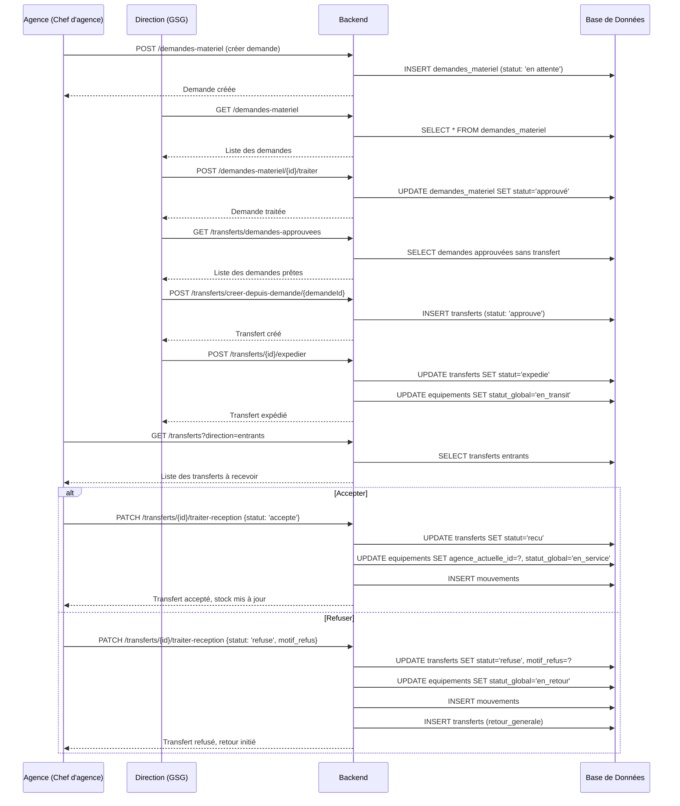

# Documentation Complète du Workflow de Demande et Transfert d'Équipement

## Vue d'ensemble
Ce document détaille le workflow complet de demande de matériel par une agence, son traitement par la direction générale, la création du transfert, et la réception/réjection par l'agence.

---

## Partie 1: Création d'une demande par l'agence

### 1.1 Contexte
Un chef d'agence ou gestionnaire de stock agence souhaite demander un équipement au siège social (direction générale).

### 1.2 Fichiers Concernés

#### Backend
- **Modèle**: `backend/app/Models/DemandeMateriel.php` // Modèle représentant une demande de matériel
- **Contrôleur**: `backend/app/Http/Controllers/Agence/DemandeMaterielController.php` // Contrôleur gérant les demandes de matériel
- **Requête de validation**: `backend/app/Http/Requests/Agence/StoreDemandeMaterielRequest.php` // Requête de validation pour la création d'une demande de matériel
- **Routes**: `backend/routes/api.php`

#### Frontend
- **Vue principale**: `frontend/src/views/agence/demandes-materiel/DemandesView.vue`
- **API**: `frontend/src/api/demandeAgenceApi.js`
- **Stores**: `frontend/src/stores/demandeAgenceStore.js`

---

### 1.3 Flux d'exécution (Étape par Étape)

#### Étape 1: L'agence accède à la page des demandes
- L'utilisateur (chef d'agence) navigue vers `/demandes-materiel`
- La vue `DemandesView.vue` charge les demandes existantes via `demandeAgenceApi.index()`
- Le contrôleur `DemandeMaterielController@index()` retourne toutes les demandes de l'agence connectée (filtrées par `agence_id`)

```php
// backend/app/Http/Controllers/Agence/DemandeMaterielController.php
public function index()
{
    $user = Auth::user();
    $query = DemandeMateriel::with(['equipement', 'chefAgence', 'agence']);
    
    if (!$user->hasAnyRole(['super_admin', 'gestionnaire_stock_general', 'technicien_maintenance'])) {
        $query->where('agence_id', $user->agence_id);
    }
    
    $demandes = $query->latest()->get();
    return response()->json([...]);
}
```

#### Étape 2: Création d'une nouvelle demande
- Le chef d'agence clique sur "Nouvelle demande"
- Il remplit le formulaire avec les informations:
  - `equipement_id`: L'équipement souhaité
  - `quantite`: Quantité demandée
  - `urgence`: Niveau d'urgence (Basse/Moyenne/Haute)
  - `motif`: Justification
  - `date_souhaitee`: Date souhaitée de réception

#### Étape 3: Validation et enregistrement
- Les données sont envoyées à `POST /api/demandes-materiel` (route définie dans `api.php`)
- La requête est validée par `StoreDemandeMaterielRequest`
- Le contrôleur `DemandeMaterielController@store()` crée la demande avec le statut initial "en attente"

```php
// backend/app/Http/Controllers/Agence/DemandeMaterielController.php
public function store(StoreDemandeMaterielRequest $request)
{
    $user = Auth::user();
    if (!$user->agence_id) {
        return response()->json([...], 403);
    }
    
    $demande = DemandeMateriel::create([
        'agence_id' => $user->agence_id,
        'chef_agence_id' => $user->id,
        'equipement_id' => $request->equipement_id,
        'quantite' => $request->quantite,
        'urgence' => $request->urgence,
        'motif' => $request->motif,
        'date_souhaitee' => $request->date_souhaitee,
        'statut' => 'en attente',
    ]);
    
    return response()->json([...], 201);
}
```

---

## Partie 2: Traitement de la demande par la direction générale

### 2.1 Contexte
Le gestionnaire de stock général (GSG) voit toutes les demandes en attente et doit décider d'approuver, approuver partiellement ou rejeter la demande.

### 2.2 Fichiers Concernés

#### Backend
- **Contrôleur**: `backend/app/Http/Controllers/Direction/DemandeAgenceController.php`

#### Frontend
- **Vue principale**: `frontend/src/views/agence/demandes-materiel/DemandesView.vue` (même vue que l'agence, mais avec des options supplémentaires pour le GSG)

---

### 2.3 Flux d'exécution (Étape par Étape)

#### Étape 1: Le GSG accède à la liste des demandes
- Le GSG accède à la même page `/demandes-materiel`
- Le contrôleur retourne toutes les demandes de toutes les agences (car il a le rôle `gestionnaire_stock_general`)
- La vue affiche un bouton "Traiter" pour chaque demande en attente

#### Étape 2: Traitement de la demande
- Le GSG clique sur "Traiter" pour une demande
- Il choisit une décision:
  - **Approuver**: Approuve la quantité demandée
  - **Partiel**: Approuve une quantité inférieure à celle demandée
  - **Refuser**: Rejette la demande (obligatoire de fournir un motif)

#### Étape 3: Enregistrement de la décision
- La décision est envoyée à `POST /api/demandes-materiel/{id}/traiter` (route dans `api.php`)
- Le contrôleur `DemandeAgenceController@traiter()` met à jour la demande

```php
// backend/app/Http/Controllers/Direction/DemandeAgenceController.php
public function traiter(Request $request, $id)
{
    $demande = DemandeMateriel::with('equipement')->findOrFail($id);
    
    $request->validate([
        'decision' => 'required|in:Approuver,Refuser,Partiel',
        'quantite_validee' => [
            'required_if:decision,Approuver,Partiel',
            'integer',
            'min:1',
            function ($attribute, $value, $fail) use ($request, $stockDisponible) {
                if (in_array($request->decision, ['Approuver', 'Partiel']) && $value > $stockDisponible) {
                    $fail("La quantité validée ne peut pas dépasser le stock disponible.");
                }
            },
        ],
        'observations' => 'required_if:decision,Refuser|string|nullable',
    ]);
    
    $statutMapping = [
        'Approuver' => 'approuvé',
        'Refuser' => 'rejeté',
        'Partiel' => 'approuvé',
    ];
    
    $demande->update([
        'statut' => $statutMapping[$request->decision],
        'quantite' => $request->decision === 'Partiel' ? $request->quantite_validee : $demande->quantite,
        'observations' => $request->observations,
        'traite_par_id' => Auth::id(),
    ]);
    
    return response()->json([...]);
}
```

---

## Partie 3: Création du transfert par la direction générale

### 3.1 Contexte
Après avoir approuvé une demande, le GSG doit créer un transfert pour envoyer l'équipement à l'agence.

### 3.2 Fichiers Concernés

#### Backend
- **Modèle**: `backend/app/Models/Transfert.php`
- **Contrôleur**: `backend/app/Http/Controllers/Direction/TransfertController.php`

#### Frontend
- **Vue principale**: `frontend/src/views/direction/transferts/TransfertsView.vue`
- **API**: `frontend/src/api/transfertApi.js`
- **Stores**: `frontend/src/stores/transfertStore.js`

---

### 3.3 Flux d'exécution (Étape par Étape)

#### Étape 1: Affichage des demandes approuvées prêtes à transférer
- Le GSG accède à `/transferts`
- La vue `TransfertsView.vue` charge les demandes approuvées via `transfertApi.getDemandesApprouvees()`
- Le contrôleur `TransfertController@getApprovedDemandes()` retourne les demandes avec statut "approuvé" et sans transfert associé

```php
// backend/app/Http/Controllers/Direction/TransfertController.php
public function getApprovedDemandes()
{
    $demandes = DemandeMateriel::with(['agence', 'equipement', 'chefAgence'])
        ->where('statut', 'approuvé')
        ->whereDoesntHave('transferts', function($query) {
            $query->whereIn('statut', ['demande', 'approuve', 'expedie', 'recu']);
        })
        ->get();
    
    return response()->json([...]);
}
```

#### Étape 2: Création du transfert depuis une demande approuvée
- Le GSG clique sur "Lancer le transfert" pour une demande
- La requête est envoyée à `POST /api/transferts/creer-depuis-demande/{demandeId}`
- Le contrôleur `TransfertController@createFromDemande()` crée le transfert

```php
// backend/app/Http/Controllers/Direction/TransfertController.php
public function createFromDemande(Request $request, $demandeId)
{
    $demande = DemandeMateriel::findOrFail($demandeId);
    if ($demande->statut !== 'approuvé') {
        throw new \Exception("Seules les demandes approuvées peuvent être transférées.");
    }
    
    $existingTransfert = Transfert::where('demande_materiel_id', $demande->id)
        ->whereIn('statut', ['demande', 'approuve', 'expedie', 'recu'])
        ->first();
    
    if ($existingTransfert) {
        throw new \Exception("Un transfert existe déjà pour cette demande.");
    }
    
    DB::transaction(function () use ($demande, $user) {
        $agenceGenerale = Agence::where('type', 'generale')->first();
        $agenceSourceId = $demande->equipement->agence_actuelle_id ?? $agenceGenerale?->id;
        
        Transfert::create([
            'demande_materiel_id' => $demande->id,
            'equipement_id' => $demande->equipement_id,
            'agence_source_id' => $agenceSourceId,
            'agence_destination_id' => $demande->agence_id,
            'type_transfert' => 'livraison_generale',
            'statut' => 'approuve',
            'demande_par_id' => $demande->chef_agence_id,
            'valide_par_id' => $user->id,
            'date_demande' => $demande->created_at,
            'quantite' => $demande->quantite,
            'observations' => "Transfert généré depuis la demande #" . $demande->id . ". Motif: " . $demande->motif,
        ]);
    });
    
    return response()->json([...]);
}
```

#### Étape 3: Expédition du transfert (optionnel)
- Le GSG peut également marquer le transfert comme "expédié"
- Requête: `POST /api/transferts/{id}/expedier`
- Contrôleur: `TransfertController@expedier()`
- Le modèle `Transfert` met à jour le statut et l'équipement associé

```php
// backend/app/Models/Transfert.php
public function expedier($userId)
{
    $this->update([
        'statut' => 'expedie',
        'date_expedition' => now()
    ]);
    
    if ($this->equipement) {
        $this->equipement->update([
            'statut_global' => 'en_transit',
            'localisation' => 'En transfert vers ' . ($this->agenceDestination->nom ?? 'Destination')
        ]);
        
        $this->equipement->createMouvement(
            'transfert',
            "Expédition du transfert vers " . ($this->agenceDestination->nom ?? 'Destination'),
            $userId
        );
    }
}
```

---

## Partie 4: Réception ou rejet du transfert par l'agence

### 4.1 Contexte
L'agence destination reçoit le transfert et doit décider de l'accepter ou de le refuser.

### 4.2 Fichiers Concernés

#### Backend
- **Service**: `backend/app/Services/StockAgenceService.php`
- **Contrôleur**: `backend/app/Http/Controllers/Direction/TransfertController.php` (méthode `traiterReception`)

#### Frontend
- **Vue principale**: `frontend/src/views/agence/stock/ReceptionView.vue`

---

### 4.3 Flux d'exécution (Étape par Étape)

#### Étape 1: Accès à la page de réception
- L'agence accède à `/stock/reception`
- La vue `ReceptionView.vue` charge les transferts entrants via `transfertApi.index()` avec filtres
- Seuls les transferts avec statut `approuve` ou `expedie` sont affichés pour traitement

#### Étape 2: Décision de l'agence
L'agence a deux options:

##### Option A: Accepter le transfert
- L'utilisateur clique sur "Accepter"
- Une demande de confirmation s'affiche
- Après confirmation, la requête est envoyée à `PATCH /api/transferts/{id}/traiter-reception` avec `statut: 'accepte'`

##### Option B: Refuser le transfert
- L'utilisateur clique sur "Refuser"
- Un formulaire s'affiche pour saisir le motif de refus
- Le motif est obligatoire
- La requête est envoyée à `PATCH /api/transferts/{id}/traiter-reception` avec `statut: 'refuse'` et `motif_refus`

#### Étape 3: Traitement de la décision par le backend
Le contrôleur `TransfertController@traiterReception()` gère les deux cas:

```php
// backend/app/Http/Controllers/Direction/TransfertController.php
public function traiterReception(Request $request, $id)
{
    $user = $request->user();
    $transfert = Transfert::with(['equipement', 'agenceSource', 'agenceDestination'])
        ->findOrFail($id);
    
    // Vérification des permissions
    if (!$user->hasRole(['super_admin', 'gestionnaire_stock_general']) && $user->agence_id !== $transfert->agence_destination_id) {
        return response()->json([...], 403);
    }
    
    // Vérification du statut
    if (!in_array($transfert->statut, ['approuve', 'expedie'])) {
        return response()->json([...], 400);
    }
    
    $validated = $request->validate([
        'statut' => 'required|string|in:accepte,refuse',
        'motif_refus' => 'required_if:statut,refuse|nullable|string|max:1000',
    ]);
    
    DB::beginTransaction();
    
    if ($validated['statut'] === 'accepte') {
        // Cas 1: Acceptation
        $transfert->recevoir($user->id);
        $message = "Équipement '{$transfert->equipement->nom}' accepté et ajouté au stock de l'agence.";
    } else {
        // Cas 2: Refus
        $transfert->refuser($user->id, $validated['motif_refus']);
        
        if ($transfert->equipement) {
            $transfert->equipement->update(['statut_global' => 'en_retour']);
            
            // Création d'un mouvement de traçabilité
            $transfert->equipement->createMouvement(
                'retour',
                "Équipement refusé à la réception par {$user->name}. Motif : {$validated['motif_refus']}",
                $user->id,
                ['agence_id' => $transfert->agence_destination_id],
                ['agence_id' => $transfert->agence_source_id]
            );
            
            // Création automatique d'un transfert de retour
            Transfert::create([
                'equipement_id' => $transfert->equipement_id,
                'agence_source_id' => $transfert->agence_destination_id,
                'agence_destination_id' => $transfert->agence_source_id,
                'demande_par_id' => $user->id,
                'type_transfert' => 'retour_generale',
                'statut' => 'demande',
                'date_demande' => now(),
                'observations' => "Retour automatique suite au refus de réception. Motif : {$validated['motif_refus']}",
            ]);
        }
        
        $message = "Transfert refusé. L'équipement est en attente de retour à l'agence source.";
    }
    
    DB::commit();
    return response()->json([...]);
}
```

#### Étape 4: Méthodes du modèle Transfert
Les méthodes `recevoir()` et `refuser()` du modèle `Transfert` effectuent les actions finales:

```php
// backend/app/Models/Transfert.php
public function recevoir($userId)
{
    $this->update([
        'statut' => 'recu',
        'date_reception' => now()
    ]);
    
    if ($this->equipement) {
        $this->equipement->update([
            'agence_actuelle_id' => $this->agence_destination_id,
            'statut_global' => $this->type_transfert === 'retour_generale' ? 'en_stock_general' : 'en_service'
        ]);
        
        $this->equipement->createMouvement(
            'transfert',
            "Réception transfert depuis " . ($this->agenceSource->nom ?? 'Origine'),
            $userId
        );
    }
    
    // Incrémente le stock de l'agence destination
    $stockService = App::make(StockAgenceService::class);
    $stockService->incrementerStockReception($this);
}

public function refuser($userId, $observations = null)
{
    $oldStatus = $this->statut;
    
    $this->update([
        'statut' => 'refuse',
        'valide_par_id' => $userId,
        'motif_refus' => $observations,
        'observations' => $this->observations . "\nRefusé/Annulé : " . $observations
    ]);
    
    if ($oldStatus === 'expedie' || $oldStatus === 'recu') {
        $stockService = App::make(StockAgenceService::class);
        $stockService->decrementerStock($this, 'rejet');
    }
}
```

---

## Partie 5: Statuts et Répartition des Transferts

### 5.1 Statuts de DemandeMateriel
| Statut | Description |
|--------|-------------|
| `en attente` | Demande créée par l'agence, en attente de traitement par le GSG |
| `approuvé` | Demande approuvée (totalement ou partiellement) par le GSG |
| `rejeté` | Demande refusée par le GSG |

### 5.2 Statuts de Transfert
| Statut | Description |
|--------|-------------|
| `brouillon` | Transfert créé mais pas finalisé |
| `demande` | Transfert en attente de validation |
| `approuve` | Transfert approuvé, prêt à être expédié |
| `expedie` | Transfert expédié, en transit |
| `recu` | Transfert reçu et accepté par l'agence destination |
| `refuse` | Transfert refusé par l'agence destination ou annulé |

### 5.3 Types de Transfert
| Type | Description |
|------|-------------|
| `livraison_generale` | Livraison du siège vers une agence |
| `retour_generale` | Retour d'une agence vers le siège |
| `transfert_interne` | Transfert entre deux agences |

### 5.4 Filtres et Vues
- **Vue GSG**: Voir tous les transferts, filtrer par statut, type, direction
- **Vue Agence**: Voir seulement les transferts entrants et sortants de leur agence
- **Vue Kanban**: Vue tableau avec colonnes "À expédier", "En transit", "Reçu"

---

## Partie 6: Routes API Complètes

### Demandes de Matériel
| Méthode | Route | Contrôleur | Description |
|---------|-------|------------|-------------|
| GET | `/api/demandes-materiel` | `DemandeMaterielController@index` | Liste des demandes |
| POST | `/api/demandes-materiel` | `DemandeMaterielController@store` | Créer une demande |
| PUT | `/api/demandes-materiel/{id}` | `DemandeMaterielController@update` | Mettre à jour une demande |
| DELETE | `/api/demandes-materiel/{id}` | `DemandeMaterielController@destroy` | Supprimer une demande |
| POST | `/api/demandes-materiel/{id}/traiter` | `DemandeAgenceController@traiter` | Traiter une demande (GSG) |

### Transferts
| Méthode | Route | Contrôleur | Description |
|---------|-------|------------|-------------|
| GET | `/api/transferts` | `TransfertController@index` | Liste des transferts |
| GET | `/api/transferts/{id}` | `TransfertController@show` | Détails d'un transfert |
| POST | `/api/transferts` | `TransfertController@store` | Créer un transfert |
| POST | `/api/transferts/creer-depuis-demande/{demandeId}` | `TransfertController@createFromDemande` | Créer un transfert depuis une demande |
| GET | `/api/transferts/demandes-approuvees` | `TransfertController@getApprovedDemandes` | Liste des demandes approuvées prêtes à transférer |
| POST | `/api/transferts/{id}/approuver` | `TransfertController@approuver` | Approuver un transfert |
| POST | `/api/transferts/{id}/refuser` | `TransfertController@refuser` | Refuser/annuler un transfert |
| POST | `/api/transferts/{id}/expedier` | `TransfertController@expedier` | Expédier un transfert |
| POST | `/api/transferts/{id}/recevoir` | `TransfertController@recevoir` | Recevoir un transfert |
| PATCH | `/api/transferts/{id}/traiter-reception` | `TransfertController@traiterReception` | Traiter la réception (accepter/refuser) |
| GET | `/api/transferts/statistiques` | `TransfertController@statistiques` | Statistiques des transferts |
| GET | `/api/transferts/options` | `TransfertController@getOptions` | Options (statuts, types) |

---

## Partie 7: Diagramme du Workflow Complet



---

## Partie 8: Points Clés et Sécurité

### 8.1 Sécurité
- **Middleware d'authentification**: Toutes les routes sont protégées par `auth:sanctum`
- **Middleware de rôle**: Vérification des rôles pour les actions sensibles (ex: seul GSG peut traiter les demandes)
- **Middleware d'agence scope**: Filtrage automatique des données par agence pour les utilisateurs non globaux
- **Validation des données**: Toutes les requêtes sont validées via des Form Request ou validate() dans les contrôleurs
- **Transactions DB**: Utilisation de transactions pour garantir la cohérence des données lors de multiples opérations

### 8.2 Traçabilité
- **Mouvements d'équipement**: Chaque action sur un équipement crée un enregistrement dans la table `mouvements`
- **Historique des statuts**: Les changements de statut sont enregistrés
- **Utilisateur responsable**: Chaque action est associée à l'utilisateur qui l'a effectuée (ex: `traite_par_id`, `valide_par_id`)

### 8.3 Intégrité des Données
- **Vérification du stock**: Impossible d'approuver une demande si le stock disponible est insuffisant
- **Vérification des doublons**: Impossible de créer plusieurs transferts pour la même demande approuvée
- **Intégrité référentielle**: Utilisation de clés étrangères dans la base de données

